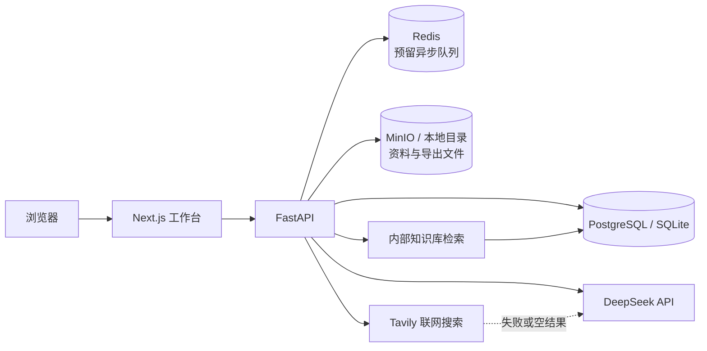

# 政企拜访助手

面向政企客户经理和解决方案经理的拜访前准备智能体 MVP。系统把客户摸底、需求拆解、移动能力匹配、初步方案和拜访话术串成一条可审核、可追溯、可导出的工作流，目标是将单次拜访准备时间降低至少 60%。

> 当前版本不包含登录、角色和权限隔离，仅适合本地开发、受控内网、VPN 或临时演示环境。请勿将服务直接暴露到公网，也不要录入未经授权的真实客户敏感数据。

## 功能概览

- 客户摸底：使用一轮综合联网搜索整理十项固定档案字段；关键字段缺失或主体冲突时最多再执行一轮合并补查，外部事实保留来源与采集时间。
- 需求拆解：从沟通记录中提取显性需求、隐性痛点、建设期望、关注事项和待确认问题。
- 能力匹配：仅基于内部知识库匹配产品、云业务、专线、行业方案、服务能力和案例；知识库支持上传、列表和单条删除。
- 初步方案：生成客户现状、建设目标、方案组合、建设思路、预期价值与风险边界。
- 拜访话术：覆盖开场破冰、背景确认、需求深挖、方案讲解、异议处理和收尾跟进，并自动保留初步方案的原始风险边界。
- 客户与选项管理：已有客户支持输入完整名称后彻底删除；拜访类型、客户角色和表达风格支持全局共享的自定义选项，内置默认项受保护。
- 客户主体识别：先在本地客户中模糊匹配，不消耗模型 Token；用户明确点击后才执行一轮联网主体消歧，最多展示 3 个候选。系统同时保留原始输入名称与规范名称，无法可靠确认时可明确沿用输入并标记“未核实”。
- 人工审核：五项成果均使用专用卡片展示，并可在模块内进行结构化编辑；保存后版本递增并自动恢复为待确认状态。
- 引用核验：客户事实与能力匹配可打开引用侧栏，查看网页/文件元数据、原文片段、逐字引用高亮及人工修改历史。
- 成果导出：全部确认后导出可编辑 Word 和排版后的 PDF，页面与导出文件共用结构化数据，不显示 `label`、`value`、`document_id` 等内部字段；Word 显式声明中文字体，长表格支持重复表头与整行分页，引用来源自动去重。
- 提示词管理：按任务维护模板、版本和启停状态，启用版本用于后续生成。

### 工作台界面

- 准备信息置于工作区顶部，已有成果时自动收起为客户、拜访类型、客户角色和表达风格摘要；需要修改时可随时展开。
- 左侧导航支持手动折叠，并在中等宽度屏幕自动切换为图标模式，为成果内容释放更多空间。
- “拜访准备态势”实时显示客户档案完整度、内部证据覆盖、人工确认进度和知识库资料数；下方用三段式路径串联客户需求、移动能力和预期价值。所有指标均由当前结构化成果计算，不额外调用模型。
- 五步成果导航可直接跳转到对应模块；已确认模块自动折叠，仍可展开查看或编辑，长页面右下角提供返回顶部按钮。
- 演示模式提高全局字号并改为单列成果卡片，适合会议室投屏和方案讲解；普通模式保持更高的信息密度。
- 桌面、平板和窄屏采用响应式布局，主要交互区域不小于 44px，并提供键盘焦点样式和减少动态效果支持。

## 系统架构



当前 MVP 默认使用 FastAPI `BackgroundTasks` 和本地文件目录；Redis、MinIO 与 pgvector 已在基础设施配置中预留，尚未完整替换本地实现。

### 智能体执行流程


网页、附件和沟通记录始终作为待分析数据，其中出现的指令不能覆盖系统规则或触发外部操作。

## 技术栈

| 层级 | 技术 |
| --- | --- |
| 前端 | Next.js 15、React 19、TypeScript、Lucide Icons |
| 后端 | Python 3.12、FastAPI、SQLAlchemy、Pydantic |
| 大模型 | DeepSeek OpenAI-compatible API，默认 `deepseek-v4-flash` |
| 公开检索 | Tavily Search API；DeepSeek Pro 原生 Web Search 兜底 |
| 数据 | PostgreSQL 16 + pgvector；本地开发可使用 SQLite |
| 基础设施 | Redis 7、MinIO、Docker Compose |
| 文档处理 | pypdf、python-docx、python-pptx、openpyxl、ReportLab |

## 目录结构

```text
AgentDemo/
├─ backend/
│  ├─ app/
│  │  ├─ main.py              # API 与五步生成编排
│  │  ├─ config.py            # 环境变量与运行配置
│  │  ├─ database.py          # 数据库连接与会话
│  │  ├─ models.py            # 数据模型
│  │  ├─ schemas.py           # API 输入输出结构
│  │  └─ services/
│  │     ├─ agent.py          # 大模型调用、知识检索与安全处理
│  │     ├─ artifact_edit.py  # 五类成果编辑约束与修改审计
│  │     ├─ search.py         # Tavily 主搜索与 DeepSeek Pro 兜底
│  │     ├─ outputs.py        # 五类模型输出校验
│  │     ├─ documents.py      # PDF/Word/PPT/Excel 文本提取
│  │     └─ exporter.py       # Word/PDF 导出
│  ├─ tests/                  # 生成、搜索、导出与知识库接口测试
│  └─ requirements.txt
├─ frontend/
│  ├─ app/                    # 页面与样式
│  ├─ components/             # 成果卡片、结构化编辑器与引用侧栏
│  ├─ lib/api.ts              # 前端 API 客户端
│  ├─ package.json
│  └─ pnpm-lock.yaml
├─ .github/workflows/ci.yml
├─ .env.example
├─ docker-compose.yml
└─ README.md
```

运行时数据库、上传文件、导出成果、缓存、`.env` 和内部产品文档均被 Git 忽略。

## 环境要求

- Python 3.12
- Node.js 22 LTS
- pnpm 9.15.4（通过 Corepack 安装）
- 可选：Docker Desktop / Docker Engine + Compose
- 可选：DeepSeek API Key、Tavily API Key

## 快速启动：SQLite 演示模式

不需要 Docker 或外部 API，适合首次体验和界面开发。

### 1. 获取代码和配置

```bash
git clone https://github.com/yooyoui/AgentDemo.git
cd AgentDemo
```

仓库为私有时，执行克隆前需要由仓库所有者邀请为协作者，并在 GitHub CLI、系统凭据管理器或 SSH 中完成认证。

Windows PowerShell：

```powershell
Copy-Item .env.example .env
```

macOS / Linux：

```bash
cp .env.example .env
```

把 `.env` 中的数据库地址改为：

```env
DATABASE_URL=sqlite:///./backend/data/visit_assistant.db
```

保持 `LLM_API_KEY` 为空时，系统使用可复现的演示规则且不执行联网搜索。

### 2. 启动后端

Windows PowerShell：

```powershell
py -3.12 -m venv backend/.venv
backend\.venv\Scripts\Activate.ps1
python -m pip install -r backend/requirements.txt
python -m uvicorn backend.app.main:app --reload --port 8000
```

macOS / Linux：

```bash
python3.12 -m venv backend/.venv
source backend/.venv/bin/activate
python -m pip install -r backend/requirements.txt
python -m uvicorn backend.app.main:app --reload --port 8000
```

后端入口：

- 健康检查：<http://127.0.0.1:8000/api/health>
- OpenAPI 文档：<http://127.0.0.1:8000/api/docs>

### 3. 启动前端

打开另一个终端：

```bash
cd frontend
corepack enable
corepack prepare pnpm@9.15.4 --activate
pnpm install --frozen-lockfile
pnpm dev --port 3001
```

访问 <http://localhost:3001>。

## 完整环境：PostgreSQL、Redis 与 MinIO

复制 `.env.example` 后保留默认 PostgreSQL 地址，然后启动基础服务：

```bash
docker compose up -d postgres redis minio
```

| 服务 | 地址 |
| --- | --- |
| PostgreSQL | `localhost:5432` |
| Redis | `localhost:6379` |
| MinIO API | `localhost:9000` |
| MinIO Console | <http://localhost:9001> |

再按前述命令启动后端和前端。Docker Compose 中的默认凭据仅用于本地开发，部署前必须替换。

## 接入 DeepSeek 与 Tavily 联网搜索

在本地 `.env` 中填写配置，不要向仓库提交真实密钥：

```env
LLM_API_KEY=你的_DeepSeek_API_Key
LLM_BASE_URL=https://api.deepseek.com
LLM_MODEL=deepseek-v4-flash
LLM_SEARCH_MODEL=deepseek-v4-pro
LLM_TIMEOUT_SECONDS=90
LLM_MAX_TOKENS=4096
LLM_MAX_RETRIES=2
TAVILY_API_KEY=你的_Tavily_API_Key
TAVILY_SEARCH_DEPTH=fast
TAVILY_TIMEOUT_SECONDS=20
TAVILY_MAX_RETRIES=1
TAVILY_FALLBACK_TO_DEEPSEEK=true
```

修改后重启后端。检查模型配置：

```bash
curl http://127.0.0.1:8000/api/health
curl -X POST http://127.0.0.1:8000/api/model/test
```

PowerShell：

```powershell
Invoke-RestMethod http://127.0.0.1:8000/api/health
Invoke-RestMethod -Method Post http://127.0.0.1:8000/api/model/test
```

模型调用使用 JSON Output、结构校验、非思考模式、超时和重试。配置了 Key 后如果调用失败，生成任务会明确失败，不会静默降级为演示内容。

正式环境需设置 `APP_ENVIRONMENT=production`，并在确认客户资料允许传给外部模型后显式设置 `EXTERNAL_DATA_TRANSMISSION_ENABLED=true`。生产环境未开启该开关时，模型生成和联网搜索会被后端拒绝；开发环境保持现有本地调试行为。

`/api/health` 中 `model` 表示普通生成模型。配置 Tavily 后，`research` 为 `tavily`、`research_model` 为搜索深度，`research_fallback` 显示备用的 DeepSeek 模型；未配置 Tavily 时则直接使用 `deepseek-web`。所有 API Key 只由后端读取，不会通过健康检查、任务结果或前端返回。

## 主要 API

| 方法 | 路径 | 用途 |
| --- | --- | --- |
| `GET` | `/api/health` | 服务、模型与公开检索状态 |
| `POST` | `/api/model/test` | DeepSeek 连通性测试 |
| `POST` | `/api/search` | Tavily 优先、DeepSeek Pro 兜底的联网搜索 |
| `GET/POST` | `/api/customers` | 查询或创建客户 |
| `GET` | `/api/v1/customers/search?q=...` | 模糊搜索已有客户，返回最相关的本地结果 |
| `POST` | `/api/v1/organization-identities/resolve` | 一轮联网识别组织主体，返回最多 3 个可信候选 |
| `GET/POST` | `/api/v1/customers/{id}/identity` | 查询或确认客户主体（含明确沿用输入名称） |
| `GET` | `/api/customers/{id}` | 查询单个客户 |
| `DELETE` | `/api/customers/{id}` | 输入完整名称后彻底删除客户及关联成果、任务和导出文件 |
| `GET/POST` | `/api/workspace-options` | 查询或添加全局共享拜访选项 |
| `DELETE` | `/api/workspace-options/{id}` | 删除自定义选项（内置项不可删除） |
| `POST` | `/api/customers/{id}/research` | 异步生成或刷新客户摸底 |
| `GET` | `/api/knowledge` | 查询知识库资料 |
| `POST` | `/api/knowledge` | 上传并索引内部资料 |
| `DELETE` | `/api/knowledge/{id}` | 删除单条知识库资料及对应上传文件 |
| `GET` | `/api/prompts` | 查询提示词模板 |
| `PUT` | `/api/prompts/{task_type}` | 新建或更新指定任务的提示词模板 |
| `POST` | `/api/customers/{id}/run-all` | 异步生成整套拜访材料 |
| `GET` | `/api/tasks/{id}` | 查询生成进度和错误 |
| `GET/PUT` | `/api/artifacts`、`/api/artifacts/{id}` | 查询和修改草稿 |
| `POST` | `/api/artifacts/{id}/confirm` | 人工确认单项材料 |
| `POST` | `/api/customers/{id}/export/{docx\|pdf}` | 导出确认后的材料 |

客户删除请求体为 `{"confirmation_name":"客户完整名称"}`。服务端会精确匹配名称；存在排队中或运行中的生成任务时返回 `409`。删除范围包括客户、五类成果、历史任务、导出记录以及导出目录内对应的 Word/PDF 文件；如果记录指向导出目录以外，整个删除操作会被拒绝。

主体识别不会跟随输入逐字联网查询。页面先调用本地模糊搜索寻找已有客户；只有点击“识别主体”才发起一次合并联网搜索。候选依据名称、地区、行业和权威来源进行确定性排序并缓存 7 天。生成前必须选择候选，或明确选择“沿用输入名称（未核实）”；未核实状态会持续显示，但不会阻止当前 MVP 生成、确认和导出。

成果编辑由后端按类型校验：客户名称和能力证据不可修改，方案组合只能选择已匹配能力，拜访话术必须保持六阶段顺序并包含方案风险边界。客户事实经人工修改后会清空当前来源，同时保留原值、原状态和原始来源审计；页面与导出文件会将其标为“已补充”“核实后修改”或“用户修改”。

知识库支持 `.pdf`、`.docx`、`.pptx`、`.xlsx`、`.txt` 和 `.md`，单文件默认不超过 15 MB。删除前页面会二次确认；删除成功后，数据库记录和知识库存储目录中的对应文件会一并移除，该资料不再参与后续能力匹配。后端会拒绝删除知识库存储目录之外的路径。

删除知识库资料不会自动重写已经生成的历史草稿；历史成果中保存的引用快照仍可能保留。如需彻底清理相关客户内容，应同时人工检查并处理已有草稿和导出文件。

联网搜索示例：

```bash
curl -X POST http://127.0.0.1:8000/api/search \
  -H "Content-Type: application/json" \
  -d '{"query":"重庆 制造业 数字化建设","max_results":5}'
```

该接口优先使用 `TAVILY_API_KEY` 调用 Tavily，采用 `fast` 搜索、China 地区偏好、关闭答案和整页正文，仅保留经过 URL 校验、去重和长度限制的结构化摘要。Tavily 超时、限流、服务异常、鉴权失败、格式异常或没有有效结果时，系统在同一条业务查询内自动使用 `LLM_SEARCH_MODEL=deepseek-v4-pro` 兜底，不会增加客户摸底的业务搜索轮数。未配置 Tavily 时直接使用 DeepSeek Pro；可用 `TAVILY_FALLBACK_TO_DEEPSEEK=false` 关闭兜底。

客户摸底默认只执行一次综合联网查询，同时整理企业性质、行业、成立时间、注册资本、规模、主营业务、总部与分支、官网、数字化现状和近期项目。只有企业性质、企业规模、主营业务、官网缺失，或检测到同名主体冲突时，才会再执行一次合并补查；每次生成最多两轮业务搜索。仍无可靠来源的字段保留为“待补充”，不会根据注册资本或模型常识推算企业规模。

## 测试与构建

Windows 后端测试：

```powershell
Push-Location backend
.\.venv\Scripts\python.exe -m pytest tests -q
.\.venv\Scripts\python.exe -m unittest discover -s tests -v
Pop-Location
```

macOS / Linux 后端测试：

```bash
cd backend
.venv/bin/python -m pytest tests -q
.venv/bin/python -m unittest discover -s tests -v
```

pytest 命令适合本地快速验证；GitHub Actions 使用 `unittest discover` 运行同一批兼容测试。

前端检查：

```bash
cd frontend
pnpm exec tsc --noEmit --incremental false
pnpm build
```

Pull Request 会通过 GitHub Actions 自动执行后端测试、前端类型检查和生产构建。CI 不使用真实 DeepSeek Key。

## 协作开发流程

1. 同步最新 `main`，创建功能分支：`git switch -c feature/简短功能名`。
2. 一次提交只解决一个清晰问题，提交信息使用 `feat:`、`fix:`、`docs:`、`test:` 或 `chore:` 前缀。
3. 本地运行相关测试，确认没有提交 `.env`、数据库、上传资料或导出文件。
4. 推送分支并创建 Pull Request，说明背景、主要改动、验证方式和界面变化。
5. 至少完成一次代码评审并等待 CI 通过后再合并到 `main`。
6. 不直接在 `main` 上开发，不使用强制推送改写共享历史。

建议 Pull Request 描述包含：

- 改动解决的问题和主要实现。
- 接口、数据或兼容性变化。
- 手工验证步骤与自动测试结果。
- 安全和数据影响。
- 涉及界面时附前后对比截图。

## 安全约束

- 当前所有访问者共享同一工作空间，没有用户级数据隔离。
- `.env`、API Key、客户数据库、原始附件和导出成果禁止提交到 Git。
- 只有客户摸底、客户主体识别和显式调用 `/api/search` 时允许通过 Tavily 或 DeepSeek 兜底访问公开网页；其他生成步骤不会重复联网。
- 能力推荐必须有内部资料依据；没有依据时明确返回暂无证据。
- 不生成未经确认的产品能力、案例、报价、工期或服务承诺。
- 上线公网或录入正式客户资料前，必须补充认证、权限、审计、密钥管理和下载地址过期机制。

## 已知限制与路线

- Redis 异步任务、MinIO 对象存储和 pgvector 向量检索尚未完整启用。
- 公开摸底优先依赖 Tavily，失败时可切换 DeepSeek Pro；两者都未配置时仅展示用户输入和待核实信息。
- 当前使用单一共享空间，不区分客户经理、解决方案经理和管理员。
- 暂不包含拜访后总结、CRM/OA 集成、招投标监控和行业资讯推送。
- 后续优先补充登录权限、操作审计、正式向量检索、任务队列和真实案例评测。

## 常见问题

### 页面显示“大模型演示模式”

确认 `.env` 中已填写 `LLM_API_KEY`，保存后重启后端，再调用 `/api/model/test`。

### 客户摸底仍显示“待补充”

先检查 `/api/health`：配置 Tavily 时应返回 `research: tavily`，并显示 `research_fallback: deepseek-v4-pro`；未配置 Tavily 时应返回 `research: deepseek-web`。创建客户时尽量填写完整企业名称、地区和行业以减少同名主体冲突。系统最多执行两轮综合搜索；两轮后仍缺少可验证来源的字段会按设计保留为“待补充”，不会由模型猜测。

任务失败时可调用 `/api/search` 独立排查。若 Tavily 和 DeepSeek 都失败，接口会返回最终兜底错误；检查两个 Key 的有效性、余额、外部传输开关及网络连通性。DeepSeek 兜底仍会强制检查真实 `web_search_call`，不会把模型生成的建议或伪造链接当成搜索结果。

### 前端无法访问后端

确认后端监听 `8000` 端口。前后端分开部署时设置 `NEXT_PUBLIC_API_URL`；本地开发默认通过 Next.js 同源代理访问后端。

### 端口被占用

停止旧开发进程，或为 `uvicorn`、`pnpm dev` 指定其他端口；变更前端端口时同步检查 `CORS_ORIGINS`。

### Windows 出现 `.next/trace` 的 `EPERM`

通常是旧 Next.js 进程仍占用缓存文件。只结束该项目对应的旧 Node 进程后重新执行 `pnpm dev --port 3001`，不要批量结束其他 Node 应用。

### 无法导出 Word 或 PDF

必须先逐项确认五份材料。修改任一草稿后，该项会重新变为待确认状态。

Word 默认使用宋体正文、微软雅黑标题和 Arial 西文字体；客户档案表跨页时会重复表头并避免拆分单行。能力匹配、方案和话术采用专用结构化排版，引用资料按文档或 URL 去重。若目标机器缺少对应字体，Office 或 PDF 阅读器可能使用系统替代字体。

## 许可证

本仓库当前未授予开源许可证，保留全部权利。需要对外分发或开源前，请先明确许可证与内部资料边界。
